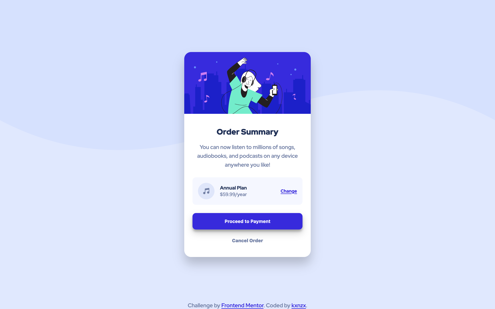
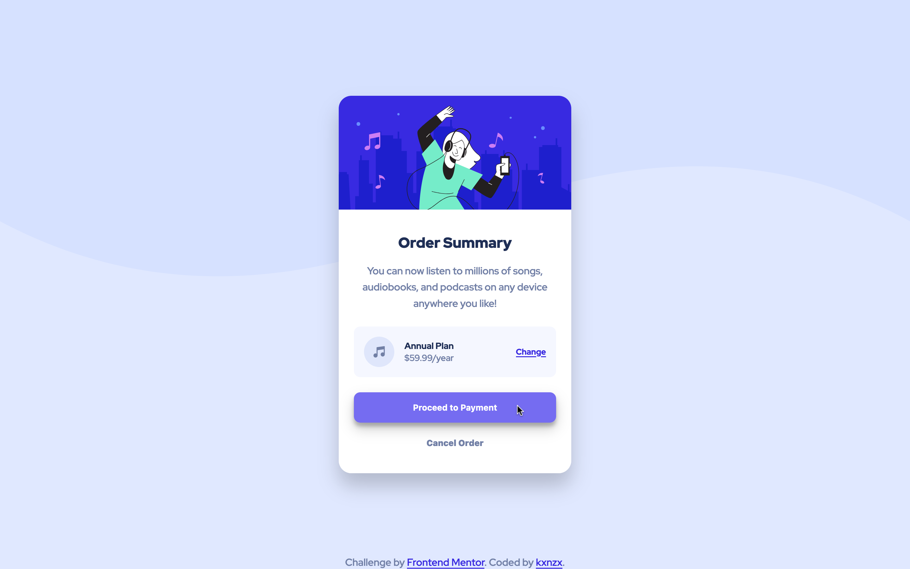

# Frontend Mentor - Order Summary Card Solution

This is a solution to the [Order Summary Card Challenge on Frontend Mentor](https://www.frontendmentor.io/challenges/order-summary-component-QlPmajDUj). Frontend Mentor challenges help you improve your coding skills by building realistic projects.

## Table of contents

- [Overview](#overview)
  - [The challenge](#the-challenge)
  - [Screenshot](#screenshot)
  - [Links](#links)
- [My process](#my-process)
  - [Built with](#built-with)
  - [What I learned](#what-i-learned)
- [Author](#author)

## Overview

### The challenge

Users should be able to:

- See hover states for interactive elements

### Screenshot

#### Screensize 1440px - Desktop



#### Screensize 1440px - Card Hover State



#### Screensize 375px - Mobile


### Links

- View my Solution on [Frontend Mentor](https://www.frontendmentor.io/solutions/order-summary-component-made-with-sass-mixin-Vq1sRG-Ql)
- View the Live Site [here](https://kxnzx.github.io/order-summary-component/)

## My process

- HTML semantics
- Importing Google Fonts
- Set variables
- Reset default settings
- Styles (Mobile First)

### Built with

- Semantic HTML5 markup
- SASS custom properties
- CSS Grid
- CSS Flexbox
- Mobile-first workflow
- [Google Fonts](https://fonts.google.com/) - For Fonts

### What I learned

- I have learned what the purpose is of "Mixins" and why & when it's convenient to use them. I made a "Partial" in which I have inserted Google Fonts, Variables, Resets and Mixins:

```scss
// _BASE.SCSS
@mixin component-width {
  max-width: 17rem;
}

@mixin grid-columns {
  display: grid;
  grid-template-columns: auto auto 1fr;
  grid-gap: 1rem;
  place-items: center;
}

@mixin border-radius {
  border-radius: 10px;
}
```

```scss
// STYLE.SCSS
.card_subscription {
      background-color: $clr_neutral_pale_blue;
      @include component-width;
      margin: 0 auto;
      @include grid-columns;
      padding: 1rem;
      @include border-radius;
      @media screen and (min-width: $tablet) {
        max-width: 20rem;
      }
```

## Author

- Frontend Mentor - [@kxnzx](https://www.frontendmentor.io/profile/kxnzx)
